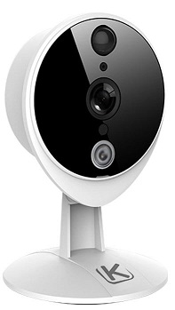
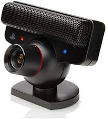

# Rapport : Système de Surveillance

# Étudiants :

- WU Sébastien
- SATHIANATHAN Sayanthan
- DUDEK Tomasz

# Professeurs :

- OSMANI Aomar
- OSMANI Aomar

# Sommaire :

- Introduction
- Description du projet

  - Présentation
  - Limite

- État de l'art

  - Le marché actuel
  - Caméra avec détection de mouvement
  - Détecteurs de mouvement

- Processus de conception et de fabrication

  - Diagramme de cas d'utilisation
  - Planning
  - Matériaux
  - Fritzing

- Fonctionnement du système

  - Description du système
  - Description de l'application

- Manuel d'utilisation

- Conclusion

# I) Introduction

Dans le cadre du projet de IOT 2020, nous avons décidé de travailler sur un système de sécurité connecté. Plus précisément, nous avons décidé de reprendre le travail du groupe Anti-theft réalisé en 2019 par Hamza CHARAI, Mingming LU, Jiazhong YIN, étudiant à l'EFREI intitulée Anti-theft. Ce projet est un système détectant uniquement l'intrusion dans une pièce et prévenant le propriétaire, nous allons donc l'améliorer pour qu'il ressemble davantage à une caméra de surveillance connectée.

Nous allons commencer par détailler davantage le principe et les limites à améliorer dans le projet Anti-theft. Ensuite nous verrons plusieurs systèmes de sécurité similaires existant sur le marché. Enfin, nous ferons une synthèse identifiant les grandes lignes d'amélioration envisageable concernant le projet.

# II) Description du projet

## A) Présentation

Le projet Anti-Theft a été réalisée avec un module ARDUINO. Avec un détecteur ultrasonique, ils surveillent le point d'accès d'une pièce. Toutes les 5 secondes la machine va enregistrer le temps d'un aller-retour fait par l'onde. Si le temps de la transmission de deux ondes est différent à au moins 30%, le système considère que quelqu'un vient d'entrer dans la pièce. Lorsqu'une "intrusion" est détectée, une alarme est émise par le système et on prévient le propriétaire à travers l'APP mobile.

Pour plus d'infos vous pouvez également retrouver ce projet, avec son code et sa documentation de base ici : <https://github.com/efrei-paris-sud/anti-theft>

## B) Limite

Premièrement, on a vu que le système est en mesure de détecter une intrusion mais aucun moyen n'a été présenté pour éteindre le système d'alarme sans débrancher tout le système. Il s'agit d'une première limite que notre groupe souhaite modifier. En ayant la possibilité d'éteindre le système d'alarme, on peut continuer à détecter les entrées et sorties dans la pièce. Ainsi on peut faire de nombreuses statistiques sur les données ainsi récoltées telles que identifier les heures à forte influence et conseiller de faire plus attention au vol à certaines heures.

De plus, une fois une intrusion détectée, le propriétaire doit lui-même arrêter le voleur. S'il est trop loin pour revenir à temps dans la pièce ou sinon incapable de confronter le voleur, le service devient inutile. C'est pourquoi nous prévoyons de prendre en photo le voleur, ainsi même si on n'arrive pas à attraper le voleur, on a la possibilité de le retrouver ou avoir un dossier de police plus complet.

Enfin, l'application mobile est très basique, on peut donc prévoir des modifications de celle-ci, mais une autre alternative pourrait être une interface web. On pourra donc afficher à travers ces plateformes les différentes statistiques, mais aussi afficher les photos des infractions avec la date et l'heure de celle-ci. Une option intéressante serait aussi de permettre de voir en direct à travers la caméra ce qui se passe dans la pièce.

# III) État de l'art

## A) Le marché actuel

Les caméras de surveillance extérieure seront le plus grand marché pour l'Internet des objets (IOT) en 5G dans le monde entier au cours des trois prochaines années, selon Gartner. Alors qu'on est encore dans l'essor de la 5G, on voit bien qu'il s'agit d'un secteur très prometteur pour les investisseurs. Aujourd'hui, ces caméras représentent déjà 70% du point de terminaison 5G IoT base installée.

On pourrait dire que l'utilisation des caméras de surveillance semble triviale, chaque jour nous enregistrons plus d'un trillion d'heure de surveillance. De plus, elle représente en 2018 quasiment 37 milliards d'euros et devrait atteindre les 70 milliards d'euro en 2023\. Le secteur de la vidéosurveillance connaît donc une croissance annuel de 13%.

 
_Graphique des pays les plus surveillés_

## B) Caméra avec détection de mouvement

La quasi totalitée des caméras de surveillance d'aujourd'hui sont dites des "caméras IP". Elles capturent les images de façon électronique et les envoient sans délai par le biais d'un réseau informatique, terminer les enregistrements sur cassette. Il s'agit ainsi du système de surveillance en directe le plus rapide et efficace.

 
_Caméra IP_

Son rôle est de permettre de visualiser à distance, en direct ou en différé, les événements qui se déroulent dans un lieu donné. Ainsi on va retrouver deux éléments essentiels, la caméra pour filmer et la carte réseaux pour envoyer les images dans un lieu de stockage ou streaming.

Néanmoins, on retrouve des caméras qui se contente de ses fonctionnalités de base et vont se différencier par leur résolution ou leur angle de vue. Mais certaines caméras embarquent des éléments supplémentaires pour proposer des fonctionnalités plus avancées aux utilisateurs plus exigeantes. On retrouve notamment des caméras équipées pour la surveillance de nuit d'un détecteur de mouvements qui déclenche un éclairage dès qu'une présence est repérée, voire même une caméra infrarouge, capable de capturer des images dans l'obscurité.

Dans l'exemple ci-dessous, on retrouve par exemple une caméra de surveillance qui est composée d'un détecteur de mouvements, une caméra grand angle et même d'un système infrarouge. En plus, elle intègre un haut-parleur et un micro pour communiquer avec la pièce surveillée ou tout simplement entendre ce qui se passe. Enfin elle est équipée d'une alarme, dissuadant le voleur de continuer ses actions.

Exemples :

- <https://www.logitech.fr/fr-fr/product/circle-2-home-security-camera/page/circle-2-how-it-works>
- <https://www.kiwatch.com/cameras-ip/camera-surveillance-interieure>

## C) Détecteurs de mouvement

Les détecteurs de mouvements sont une option souvent moins chère qu'une caméra, mais aux fonctionnalités réduites. En général un tel détecteur est constitué d'un capteur de mouvement infrarouge qui permet de capter et d'analyser le rayonnement thermique émis par quiconque. Ainsi, lorsqu'une source de chaleur circule d'un espace non surveillé vers un espace sous surveillance, l'alarme est activée. Cette solution est particulièrement efficace car elle permet de détecter une présence même dans le noir total.

De plus, étant donnée qu'on a moins de données à transférer, on peut utiliser tout aussi bien une connexion internet qu'un signal radio pour lancer l'alarme. Cette flexibilité permet à un système de détecteur de mouvement de repondre a different besoin et rend sa mise en place plus facile.

Exemples

- <https://www.scs-sentinel.com/detecteur+de+mouvement+connecte+wifisensor+motion-12846?SID_scssentinel=s8j2hohnmlverjupvnehdnk9tf>
- <https://www.bosch-smarthome.com/fr/fr/shop?url=produits/solutions-systeme-connectees/detecteur-de-mouvement>

# IV) Processus de conception et de fabrication

## A) Diagramme de cas d'utilisation

Diagramme d'utilisation décrivant les actions réalisables par l'utilisateur et par le système de surveillance de la maison :

## B) Planning

 

Tâches                                                        | Nom       | Temps (en heures)
------------------------------------------------------------- | --------- | -----------------
Ecriture du rapport                                           | Sébastien | 3
" " "                                                         | Sayanthan | 8
" " "                                                         | Tomasz    | 6
Documentation                                                 | Sayanthan | 6
Création de la Présentation                                   | Sébastien | 1
" " "                                                         | Sayanthan | 2
" " "                                                         | Tomasz    | 2
Ecriture de l'etats de l'art                                  | Sébastien | 2
" " "                                                         | Sayanthan | 4
" " "                                                         | Tomasz    | 6
Réalisation des TPs                                           | Sébastien | 10
" " "                                                         | Sayanthan | 2
Création de l'interface web                                   | Sayanthan | 8
Mise en place d'une alerte par mail                           | Sébastien | 4
" " "                                                         | Sayanthan | 3
Documentation et création des fonctionnalités pour la caméra  | Tomasz    | 10
Mise en place d'une alerte avec buzzer                        | Sébastien | 2
Mise en place d'un capteur de mouvement                       | Sébastien | 2
Création des fonctionnalités d'interaction par pavé numérique | Sébastien | 4
Mise en place des interactions LCD                            | Sébastien | 4
Création de la User case                                      | Sébastien | 1
" " "                                                         | Sayanthan | 3
" " "                                                         | Tomasz    | 2
Création diagramme d'activité                                 | Sayanthan | 2
Création du Fritzing                                          | Sébastien | 2
Branchements arduino                                          | Sébastien | 2
Résolution problème code                                      | Sayanthan | 5
Diaporama final                                               | Sayanthan | 3
" " "                                                         | Sébastien | 1
" " "                                                         | Tomasz    | 2
Recherche et achat du matériel                                | Sébastien | 2
" " "                                                         | Sayanthan | 2
" " "                                                         | Tomasz    | 2
Réalisation de la vidéo de présentation                       | Sébastien | 2
" " "                                                         | Sayanthan | 1
" " "                                                         | Tomasz    | 1

## C) Matériaux

Voici une liste des matériaux à se procurer pour reproduire le projet sans problème. Tout peut se trouver sur Amazon ou vous demandez poliment à votre enseignant. Bien sûr, il faut qu'il n'y ait pas de confinement pour que le projet se fasse de la plus belle des manières. Vous pourriez vous retrouver dans notre cas avec les matériaux éparpillés au sein du groupe. 
 
 
_Carte Arduino, microcontroller_

 
_Écran LCD, qui servira d'affichage sur le dispositif_

 
_Potentiomètre, pour réguler l'affichage de l'écran LCD_

 
_Capteur à ultrason, utilisée pour le contrôle d'une zone et la détection de mouvement_

 
_Matrix keypad keyboard, permettant de définir un mot de passe, activer ou désactiver le système manuellement._

 
_Buzzer, haut parleur miniature pour émettre une alarme_

 
_Caméra PS3 eye, permettant la capture de l'intrusion_

## D) Fritzing

À partir de ce modèle, vous pouvez refaire le système de surveillance. !

 

_Modèle Fritzing du système de surveillance_

# V) Fonctionnement du système

## A) Description du système

Le système de surveillance qu'on propose est une protection imparable contre les voleurs. À la moindre intrusion, nous émettons un son qui fera fuir l'assaillant et alertera le personnel immédiatement.

Prévoyant qu'on peut ne pas entendre par moment, on a songé à l'envoi de mail également. À l'époque du numérique où tout le monde est sur son smartphone, il nous paraissait obligatoire de proposer cette fonctionnalité.

Nous proposons donc un système de surveillance équipée d'un capteur de mouvement par ultrasons. Celui ci peut être activée ou desactiver un l'aide d'un keypad tactile et un écran LED. Si jamais une intrusion est détectée, le buzzer émet un signal et envoie un mail au propriétaire. Nous avons également mis en place une application web qui permet d'analyser les fréquences de passage et adapter ses déplacements à moindre frais.

Enfin, nous avons prévu d'utiliser pour notre projet une caméra PS3 eye dont nous disposons déjà un exemplaire. En effet, nous manquons de place pour brancher une caméra arduino c'est pourquoi on a prévu d'emprunter une raspberry pi qui prendra en photo l'intrus avec une caméra. Or la caméra PS3 eye filme en 640x480 à 60 hz et possède un branchement en USB contrairement à la caméra arduino qui a une fréquence de 30hz et elle nécessite beaucoup moins de branchement. En outre, il s'agit d'une caméra munie d'un microphone et d'une multitude de projet sur la détection de mouvements, nous ouvrant ainsi de nombreuses possibilités pour une future amélioration du projet.

## B) Description de l'application

Nous avons mit en place également une application web qui permet de visualiser les données récoltées via le système de surveillance. Une fois connecter sur son compte l'utilisateur pourra lier son système de surveillance avec l'application à travers la connexion wi-fi. Ensuite, lorsque le système sera en mode passif il va enregistrer les fréquence de passage dans la base de données.

L'application web a pour objectif de visualiser les données de manières adaptée à l'utilisateur. Le site affiche ainsi l'affluence sous forme d'un graphique comme celui-ci dessous. Ainsi l'élément clef de celle-ci sera l'ergonomie, l'utilisateur doit s'y retrouver facilement et doit pouvoir comprendre les données affichée facilement le public visée par ce genre de caméras étant très variée.

 
_Site traitant l'affluence_

# VI) Manuel d'utilisation

Il faut importer le projet et le mettre dans un répertoire `/www`. Nous utilisons WampServer en tant que serveur.

Après avoir installé le dispositif pour mettre en oeuvre le système de surveillance, on pourra visualiser les données sur le site.

Pour le système de surveillance :

- Logiciels nécessaires:

  - arduino
  - python

- Bibliothèque nécessaires :

  - python : <https://github.com/joeyoung/arduino_keypads>
  - LiquidCrystal : <https://github.com/joeyoung/arduino_keypads>

Pour lancer le systéme vous devez :

1. Sur arduino lancer le fichier merge.ino
2. Sur un terminal lancer le fichier mail.py : `Python mail.py`

# VII) Conclusion

Les systèmes de surveillance sont en pleine expansion dans le marché actuel. Les pays les plus développés seront autant équipés que la chine actuel. La question d'intimité sera alors posée probablement. Quant bien même, il reste d'énormes avantages et dérives aux systèmes de surveillance tel que la surveillance d'enfant en bas âge par exemple. Ce projet nous a permis de se rendre compte de l'importance qu'aura la surveillance connectée dans notre vie.
