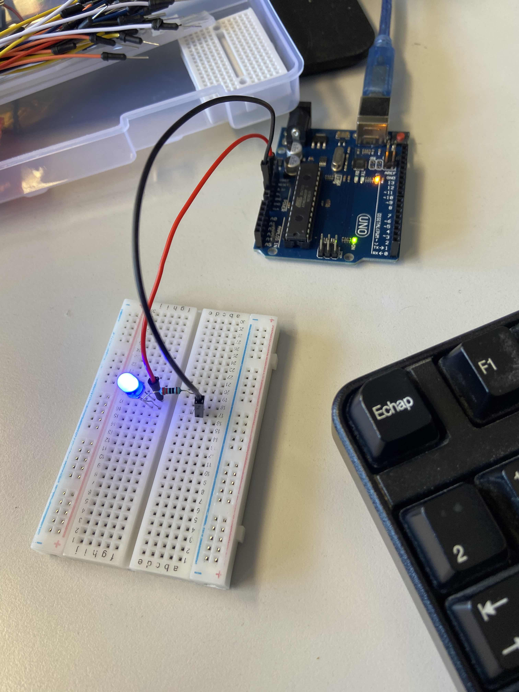

<h1>TP1</h1>
<strong>Exercice 1</strong>

Without a microcontroller

With a microcontroller
    input: variable resistance
    output: with PWM signal

code :
<pre>
int led = 1;

void setup() {
    pinMode(led, OUTPUT);
}

void loop() {
      digitalWrite(led,HIGH);
      delay(1000);
      digitalWrite(led,LOW);
      delay(1000);
}
</pre>
What are the differences? Which one is more efficient?

Avec le microcontrolleur nous pouvons appliquer du code et donc avoir plus de fonctionnalités(on, off, low, high) sur la led.
