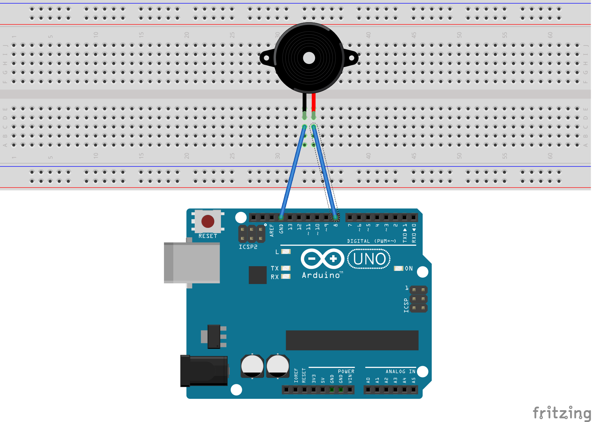
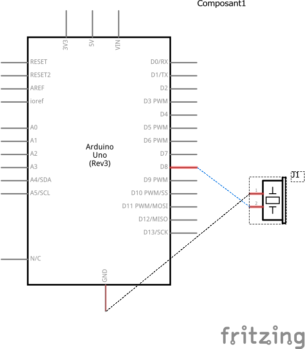
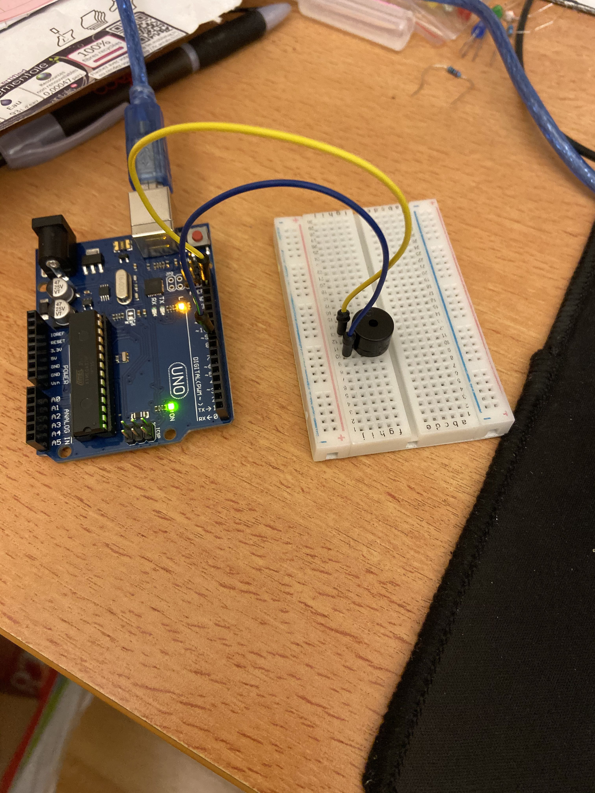
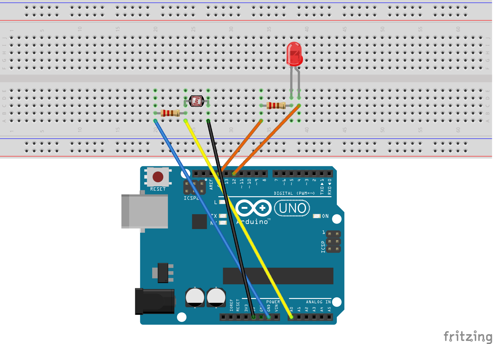
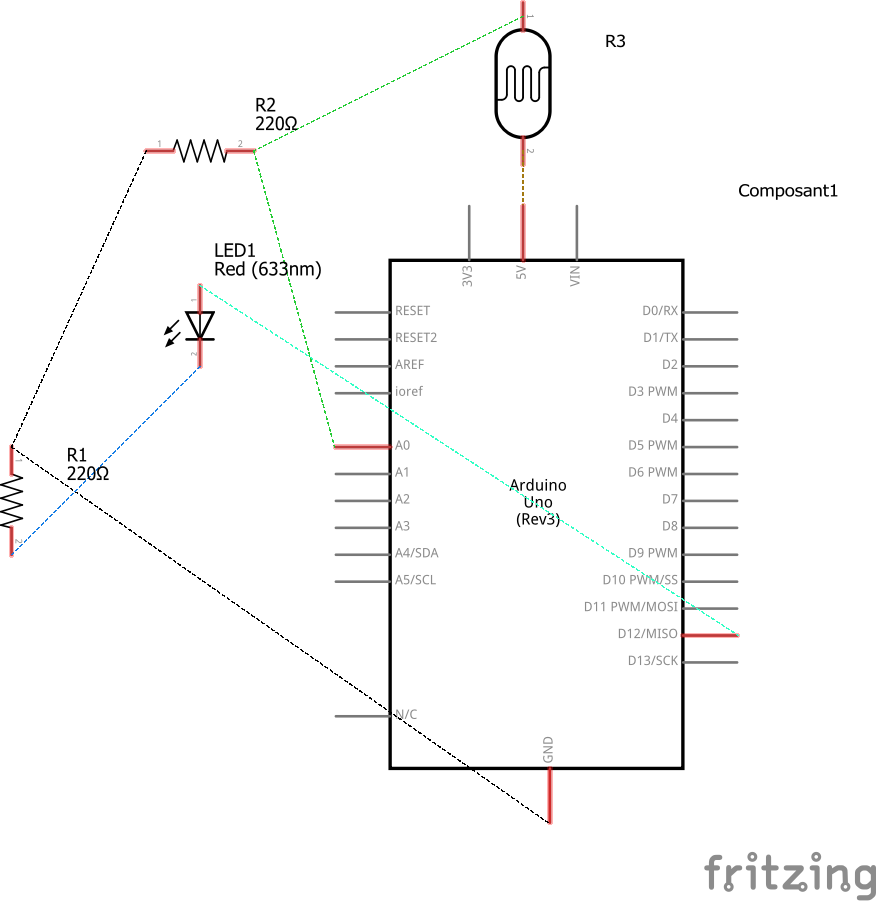
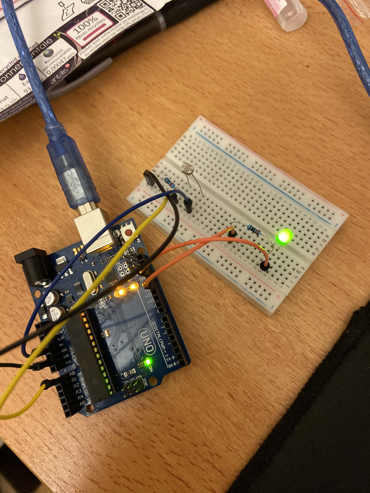
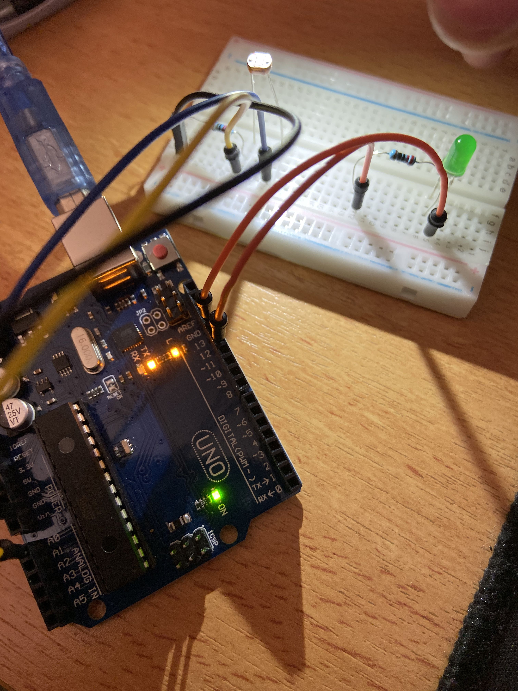
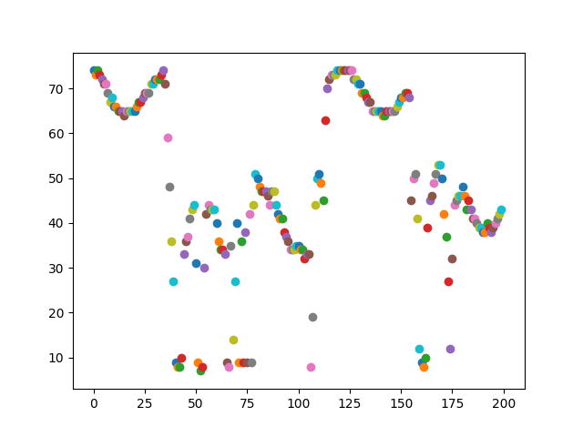

<h1>TP2</h1>
 
<h4>Buzzer frequency</h4>

<strong>code :</strong>
<pre>
int buzzer =8;
int nb=0;
void setup() {
pinMode(buzzer, OUTPUT);
Serial.begin(9600);
}
void loop() {
if(Serial.available()){
     nb = Serial.parseInt();
     tone(buzzer,nb,2000);
     Serial.println("frequency = ");
     Serial.print(nb);

   }
}
</pre>

 
<strong>LDR </strong>
 
<strong>Sketch LDR :</strong>

<strong>Schematic LDR :</strong>

Ici, nous avons une LDR avec une faible resistance donc notre led reste allumée.

Avec un flash sur notre LDR, notre led s'éteint.

<strong>Code :</strong>
<pre>
int sensorPin = A0; // select the input pin for LDR

int sensorValue = 0; // variable to store the value coming from the sensor

void setup() {
Serial.begin(9600); //sets serial port for communication
}
void loop() {
sensorValue = analogRead(sensorPin); // read the value from the sensor
Serial.println(sensorValue); //prints the values coming from the sensor on the screen

delay(100);

}
</pre>
 

<strong>Image plot :</strong>

